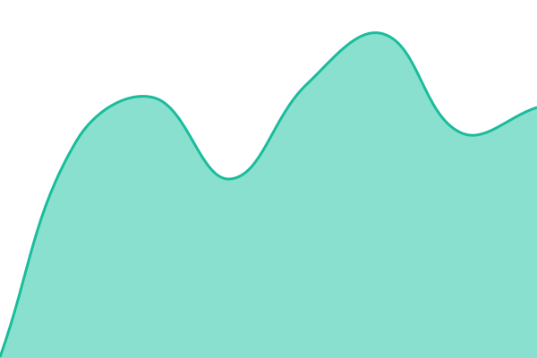
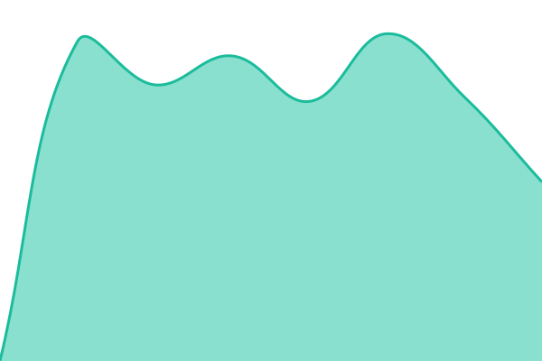
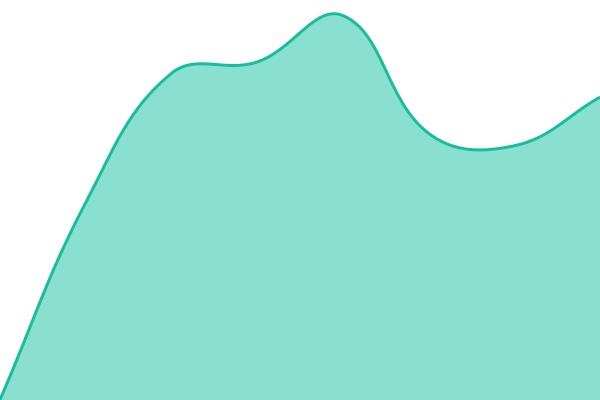
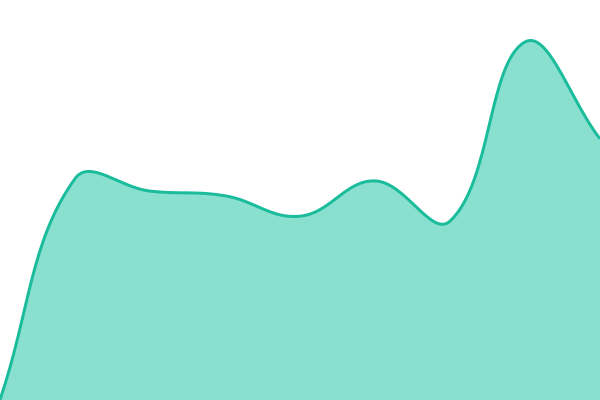
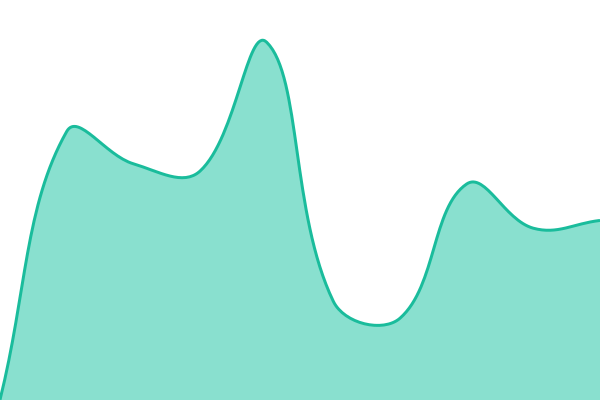

# [GolfAssist Status](https://bthomas1982-create.github.io/golfassist-uptime/)

Status, uptime and response-time history for the GolfAssist platform.

Powered by [Upptime](https://github.com/upptime/upptime). Checks run every five minutes on GitHub-hosted infrastructure, so this page stays online when the GolfAssist platform itself doesn't.

<!--start: status pages-->
<!-- This summary is generated by Upptime (https://github.com/upptime/upptime) -->
<!-- Do not edit this manually, your changes will be overwritten -->
<!-- prettier-ignore -->
| URL | Status | History | Response Time | Uptime |
| --- | ------ | ------- | ------------- | ------ |
|  [GolfAssist (marketing)](https://golfassist.ai) | 🟩 Up | [golf-assist-marketing.yml](https://github.com/bthomas1982-create/golfassist-uptime/commits/HEAD/history/golf-assist-marketing.yml) | 

 286ms
     
 | 

<a href="https://bthomas1982-create.github.io/golfassist-uptime/history/golf-assist-marketing">100.00%</a>
    

|  [Member app](https://app.golfassist.ai/app) | 🟩 Up | [member-app.yml](https://github.com/bthomas1982-create/golfassist-uptime/commits/HEAD/history/member-app.yml) | 

 917ms
     
 | 

<a href="https://bthomas1982-create.github.io/golfassist-uptime/history/member-app">100.00%</a>
    

|  [Club dashboard](https://dashboard.golfassist.ai) | 🟩 Up | [club-dashboard.yml](https://github.com/bthomas1982-create/golfassist-uptime/commits/HEAD/history/club-dashboard.yml) | 

 1045ms
     
 | 

<a href="https://bthomas1982-create.github.io/golfassist-uptime/history/club-dashboard">91.65%</a>
    

|  [Sign-up portal](https://signup.golfassist.ai) | 🟩 Up | [sign-up-portal.yml](https://github.com/bthomas1982-create/golfassist-uptime/commits/HEAD/history/sign-up-portal.yml) | 

 991ms
     
 | 

<a href="https://bthomas1982-create.github.io/golfassist-uptime/history/sign-up-portal">91.65%</a>
    

|  [Club sites](https://sites.golfassist.ai) | 🟩 Up | [club-sites.yml](https://github.com/bthomas1982-create/golfassist-uptime/commits/HEAD/history/club-sites.yml) | 

 977ms
     
 | 

<a href="https://bthomas1982-create.github.io/golfassist-uptime/history/club-sites">91.65%</a>
    

<!--end: status pages-->
